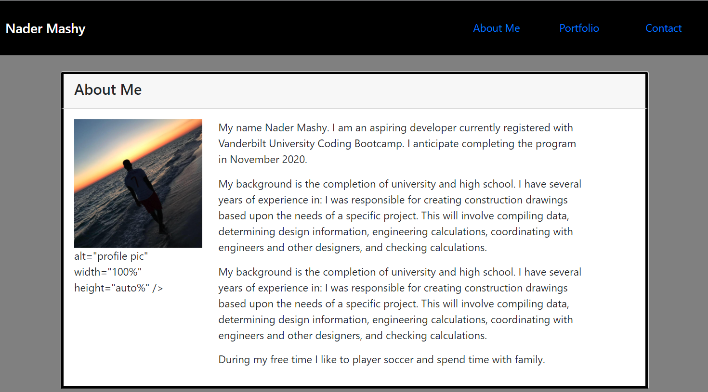

# React Portfolio

## Description

Now that you've worked with React and have multiple projects to share, you'll be updating your portfolio and other materials to build toward being employer competitive. Creating a portfolio using React will help set you apart from other developers whose portfolios do not use some of the latest technologies. If you are opting out of career services, this is still a required assignment. Part of being a web developer means being a part of a community. Having a place to share your projects is necessary if you're applying for jobs, but is still critical on your journey as a developer.

## Requirements

Updated portfolio featuring 6 total projects

Use React

A Header component that appears on multiple pages

A single Project component that will be used multiple times on a single page

Navigation with React Router, dynamic rendering, or another third part router

A Footer component that appears on multiple pages

Update GitHub profile with pinned repositories featuring those same projects

## Grading

Requirement Weight

Portoflio 90%

GitHub Profile 10%

Instructions

Updated Portfolio

Design

## Link

herokuslink

## React

Additionally, this new portfolio should be created using React. At a minimum, your portfolio should include the following:

A Header component that appears on multiple pages

A single Project component that will be used multiple times on a single page

Navigation with React Router, dynamic rendering, or another third part router

A Footer component that appears on multiple pages

## Design

As with the previous portfolio homework, "good" design is subjective. Your site should look "polished." Here are a few guidelines on what that means:

Mobile-first design

Choose a color palette for your site so it doesn't just look like the default bootstrap theme or an unstyled HTML site. You may we

Make sure the font size is large enough to read, and that the colors don't cause eye strain.

If you want to go above and beyond, try using animations and react component libraries. Note that this will not affect your grade, but it may impact how potentials employers gauge your knowledge.

## Questions

If you have any additional questions, please send them to:
GitHub: https://github.com/Nadoraluka

## License

